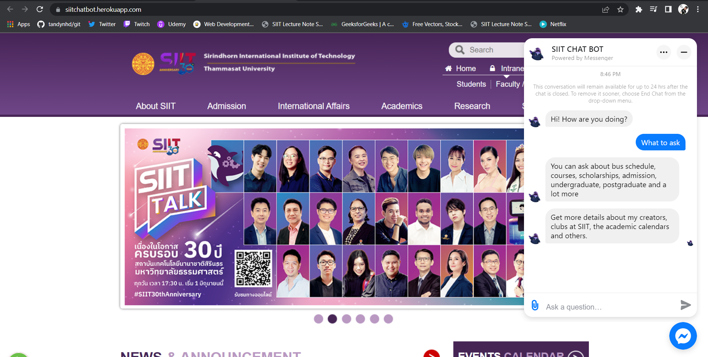

# SIIT-CHAT-BOT

Link to the mockup website: https://siitchatbot.herokuapp.com/

This is just a mockup version of SIIT's website, that we designed to showcase how our chabot would look when integrated with the actual website (which we do not have access to).

Users can play around with the messenger plugin on the bottom right of the website, that allows users to chat with SIIT Chat Bot without having to leave the website. The users can opt between chatting as a guest or chatting from their facebook accounts as the chatbot supports both.

Since this is project is completely based on the cloud (Dialogflow, Facebook, Line, Heroku) we have very minimal code that can be uploaded onto Github. This is however more of a pro than a con as having most of our application on the cloud allows us to access it from anywhere without having to install anything.
